# 🛂 Fake Passport Detection


A highly-optimized, senior-level refactored Hybrid AI verification system. It seamlessly marries **deterministic rule-based MRZ logic (ICAO 9303)** with **Deep Learning visual checks (CNN)** to detect forgeries, presented in a beautifully styled pure-Python Streamlit app.

### 🌐 Live Demo
**[Try it out here!](https://passport-detection.streamlit.app)** 
*No installation required! Just click and verify.*

---

## 🔄 How It Works

```mermaid
graph TD
    subgraph Step 1: User Input
        A["User visits Frontend"] -->|Uploads optional scan| B["Document Image"]
        A -->|Pastes 88 chars| C["MRZ Text"]
    end

    subgraph Step 2: Verification Engine
        C --> D{"MRZ Checksum Math (Hard Gate)"}
        D -->|Pass| E{"CNN Visual Check (Soft Gate)"}
        D -->|Fail| F["🚨 REJECTED (Forgery)"]
        
        B -.->|If uploaded| E
        E -->|REAL > 0.5| G["✅ PASSED"]
        E -->|FAKE| H["🚨 SUSPICIOUS"]
        
        B -.->|If selected| I["FFT Background Forensics"]
        I --> J["Guilloche & Pattern Analysis"]
    end
```



---

## 🚀 Quick Start

```bash
git clone https://github.com/Deekshith06/Fake-Passport-Detection-Using-CNN-and-Rule-Based-Validation.git
cd Fake-Passport-Detection-Using-CNN-and-Rule-Based-Validation

# Create a clean virtual environment (Python 3.11 recommended)
python3.11 -m venv venv
source venv/bin/activate

# Install the minimal dependencies
pip install -r requirements.txt

# Start the Streamlit application
streamlit run app.py
# Server runs on http://localhost:8501
```

> ⚡ **Missing Model Handling**: If you clone this and don't have the heavy `models/passport_cnn.h5` model downloaded yet, the app gracefully bypasses it and runs pure MRZ mathematical validation offline!

---

## 📂 Project Structure

```text
├── models/                        # Pre-trained CNN Models
│   └── passport_cnn.h5            # EfficientNetB0 verification weights
├── app.py                         # Single-file Monolith (UI + Backend Logic)
├── requirements.txt               # Deep-learning environment dependencies
├── .streamlit/                    
│   └── config.toml                # Native Strict Dark Mode styling
└── README.md                      # Documentation
```

---

## 🔧 Tech Stack

| Component | Technology |
|-----------|------------|
| Web Frontend | Streamlit, Custom HTML/CSS |
| AI / Vision | TensorFlow/Keras, OpenCV-Python |
| Validation Logic | Pure Python (ICAO 9303 Math) |

---

## 🤝 Call for Collaboration

**I am actively looking for a partner to collaborate on the CNN model!** 

Currently, the web-app interface and MRZ-validation rules natively operate perfectly. However, the custom `.h5` model (deep learning component) is large and highly specialized. I am looking for someone experienced in computer vision or MLOps to collaborate, optimize, and expand the CNN dataset to further combat modern ID spoofing.

If you are interested in making the CNN engine smarter:
1. Fork the repo.
2. Email me directly at **seelaboyinadeekshith@gmail.com**.
3. Let's build the ultimate open-source forgery detector!

---

## 👤 Author

**Seelaboyina Deekshith**

[](https://github.com/Deekshith06)
[](https://www.linkedin.com/in/deekshith030206)
[](mailto:seelaboyinadeekshith@gmail.com)

---

> ⭐ Star this repo if it helped you!
